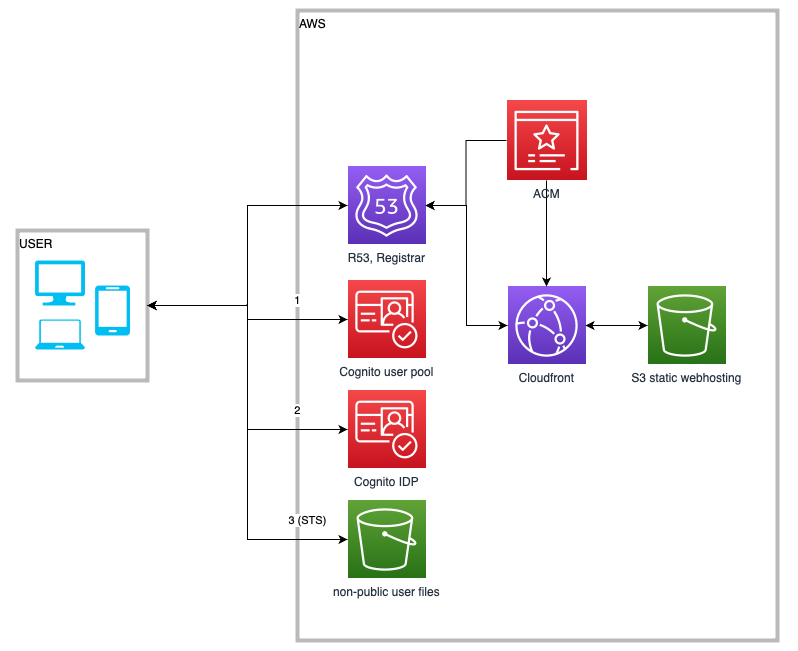

# VATEUSZ

## Description
This SPA (hosted in S3) enabled authenticated users (with AWS Cognito) to store invoice files in their protected buckets. The accountant with privileges to specific user can access the invoices added by the user and process them.

## Architecture


See more in the [Infrastructure](./infrastructure/) section.

### Tech stack
* React, typescript
* aws-amplify/react, react-bootstrap
* react-router v6
* testing-library, jest
* npm
* terraform

## Deployment
```bash
# Build
rm -rf build
npm install
npm run build

# Deploy to S3
aws s3 rm s3://{AWS_BUCKET_NAME}}/ --recursive --profile {AWS_PROFILE_NAME}
aws s3 cp ./build s3://{AWS_BUCKET_NAME}}/ --recursive --profile {AWS_PROFILE_NAME}

# Invalidate Cloud Front distribution
aws cloudfront create-invalidation --distribution-id {CLOUDFRONT_DISTRIBUTION_ID} --paths '/*' --profile {AWS_PROFILE_NAME}

```

## Available Scripts

In the project directory, you can run:

### `npm start`

Runs the app in the development mode.\
Open [http://localhost:3000](http://localhost:3000) to view it in the browser.

The page will reload if you make edits.\
You will also see any lint errors in the console.

### `npm test`

Launches the test runner in the interactive watch mode.\
See the section about [running tests](https://facebook.github.io/create-react-app/docs/running-tests) for more information.

### `npm run build`

Builds the app for production to the `build` folder.\
It correctly bundles React in production mode and optimizes the build for the best performance.

The build is minified and the filenames include the hashes.\
Your app is ready to be deployed!

See the section about [deployment](https://facebook.github.io/create-react-app/docs/deployment) for more information.
